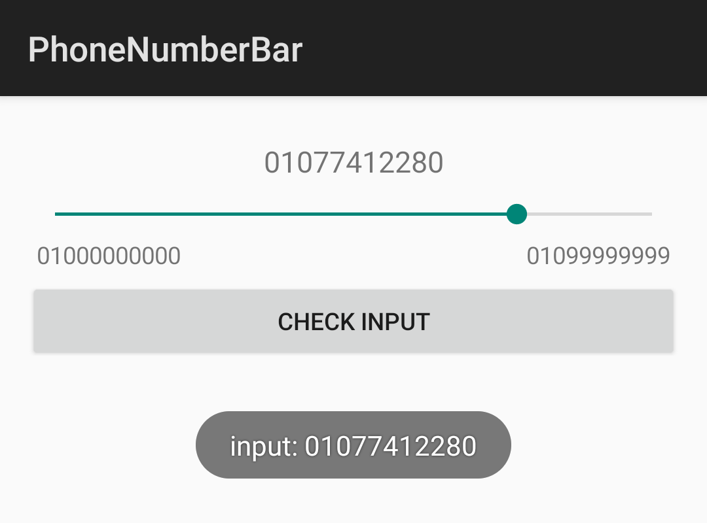

# 뒤틀린 황천의 전화번호 입력 UI
© 2023 Dark Tornado, All rights reserved.

## 사용법?
- 그냥 앱 프로젝트에다가 `PhoneNumberBar.java` 파일 적당히 복사 붙여넣기 해서 사용하시면 됩니다.

## 어떻게 생겼는가?
- 이렇게 생겼어요. [여기를 눌러서](https://www.youtube.com/watch?v=TcE-v8f5fhg) 작동 모습을 볼 수 있어요.


## 일단 대충 적은 예제
- 미래의 내가 프로젝트로 올려줄거에요.
```java
@Override
protected void onCreate(Bundle savedInstanceState) {
    super.onCreate(savedInstanceState);
    LinearLayout layout = new LinearLayout(this);
    layout.setOrientation(1);

    final PhoneNumberBar bar = new PhoneNumberBar(this);
    layout.addView(bar);

    Button btn = new Button(this);
    btn.setText("Check Input");
    btn.setOnClickListener(view - > Toast.makeText(this, "input: " + bar.getPhoneNumber(), Toast.LENGTH_SHORT).show());
    layout.addView(btn);

    setContentView(layout);
}
```

## 미래의 내가 또 할 일
- 070 전화번호 입력 지원
